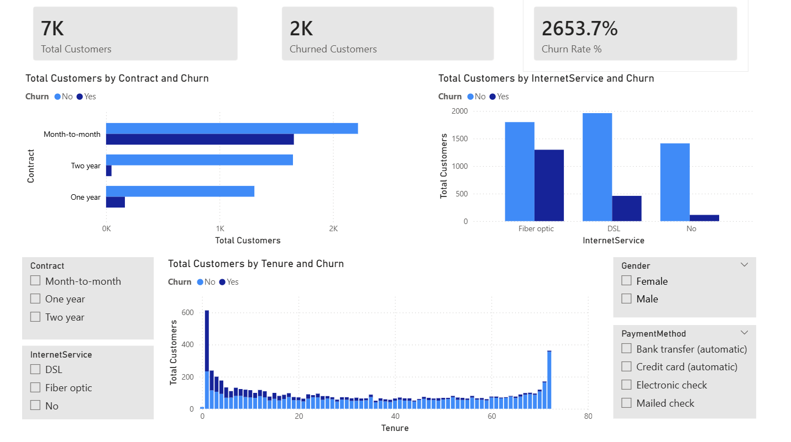

# Customer-Churn-Analysis
This is an SQL and Power BI project analyzing telecom customer churn trends and business insights.

---

## Tools Used
- SQL
- Power BI
- CSV Dataset

---

## Key Insights

-Customers with month-to-month contracts had the highest churn rate because they can leave the service more easily.

  **Solution:** Give discounts or special offers to encourage long-term contracts.

- New customers were more likely to churn in the beginning due to lack of engagement or satisfaction.
  
  **Solution:** Improve customer onboarding and provide better support during the first few months.

- Internet service type affected customer retention, as some services had higher churn than others.
  
  **Solution:** Improve service quality and address customer issues for high-churn services.

- Customers with higher monthly charges were more likely to leave the company.
  
  **Solution:** Offer affordable plans or better benefits to increase customer satisfaction.

- Customers who did not use extra services like tech support were more likely to churn.
  
  **Solution:** Encourage customers to use additional services through offers and free trials.

---

## Dashboard Preview

---

## Project Structure

Data/ → Dataset  
SQL/ → SQL queries  
PowerBI/ → Power BI dashboard  
Images/ → Dashboard screenshots
